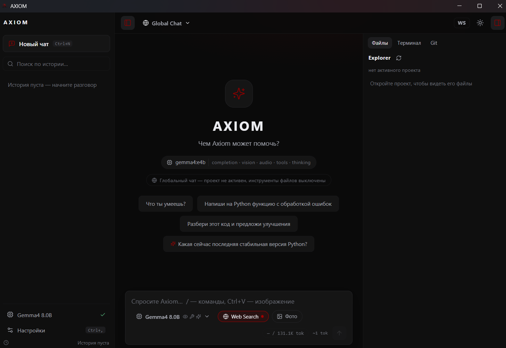

# AXIOM — Open Local AI Agent Harness

[](https://www.python.org/)
[](https://ollama.com/)
[](https://tauri.app/)
[](LICENSE)

**AXIOM** — локальный AI-агент и open agent harness для исследований, разработки и
автоматизации. Рабочий runtime построен вокруг Ollama, а ядро не зависит от
фронтенда: тот же `ChatSession` используют Textual TUI и Tauri/React GUI.

AXIOM — не «ещё один чат в терминале». Это наблюдаемый цикл
**модель → инструмент → результат → проверка → ответ**, с сохранением истории,
траекторий, разрешений и метрик.



## Зачем проект

- запускать модели локально и сохранять приватность рабочего контекста;
- дать модели реальные, но разрешённые инструменты, а не декоративный «agent mode»;
- разделять inference, UI, tools, маршрутизацию и персистентный runtime;
- подключать новые провайдеры, агентов, skills, tools, MCP и plugins через registry;
- видеть, что произошло в запуске, и измерять, где именно появилась задержка.

## Текущее состояние

Основной путь — локальный Ollama с TUI/GUI; внешние providers подключаются через
provider manager и unified streaming runtime. В ядре уже присутствуют расширяемые слои
Harness: provider adapters, model/agent/tool registries, orchestrator, trajectory store,
context engine, sandbox, skills, router, verification, MCP/plugin contracts, project
memory и performance metrics.

Это честное разделение статуса:

| Возможность | Состояние |
|---|---|
| Ollama chat, streaming, reasoning, continuation | Основной runtime |
| Textual TUI и Tauri/React desktop | Основные интерфейсы |
| Filesystem, terminal, Git, project и web tools | Работают в разрешённом workspace |
| Trajectory, EventBus, agent/tool registries | Работающий core-слой |
| Skills, sandbox, verification, project memory | Интегрированы в runtime |
| Provider/model routing | Реализован unified runtime для Ollama и внешних providers; fallback и streaming подключены |
| Внешние providers и MCP-серверы | Provider adapters и live OpenAI-compatible routing работают; live MCP ecosystem требует отдельной проверки |
| Community plugins и Code/PTC | Расширяемые core API; UI/CLI и live ecosystem в развитии |
| Performance Benchmark Engine | Метрики, cold/warm runner, repetitions и JSON export реализованы; live сравнения зависят от среды |

Подробности изменений находятся в [CHANGELOG.md](CHANGELOG.md).

## Возможности

### Local-first chat и reasoning

- streaming ответа и реального thinking/reasoning;
- reasoning отображается только тогда, когда его действительно вернула модель;
- adaptive thinking: `auto`, `fast`, `normal`, `deep` и существующий Ollama `think`;
- answer continuation после незавершённого ответа;
- ограничение числа agent/tool rounds;
- явная state machine не допускает ложный `Completed` при пустом ответе.

### Agent harness

```text
AXIOM
 ├─ ProviderManager → ModelCatalog
 ├─ AgentRegistry   → Orchestrator / Subagents
 ├─ ToolRegistry    → scoped tools / PTC
 ├─ ContextEngine   → history / project context
 ├─ EventBus        → runtime integrations
 ├─ TrajectoryStore → inspect / resume / fork / replay
 ├─ Verification    → build / test / lint
 └─ Sandbox         → ask / auto / deny
```

- `Provider` и adapters: Ollama, OpenAI-compatible API и Anthropic; known providers:
  Anthropic, OpenAI, Gemini, DeepSeek, xAI, Mistral, Qwen, Z.AI/GLM, OpenRouter,
  Together, Fireworks, Groq, Cerebras;
- `AgentRegistry`: orchestrator, coder, debugger, reviewer, researcher, tester,
  architect, security;
- tool selection по роли и задаче, чтобы не помещать ненужные инструменты в context;
- `Skills`: Python, React, TypeScript, Rust, Tauri, Git, Docker, Testing,
  Debugging, Security, SQL;
- project memory в `.axiom/`: индекс языков, зависимостей, entry points, tests и
  важных файлов;
- append-only trajectory хранит model/tool/agent events, а исходная история не
  теряется при context compression.

### Реальные tools

- filesystem: read/search/write/edit/copy/move/delete с workspace guard;
- terminal/process: команды с permission check и результатом stdout/stderr;
- Git: status, diff, log, branches и безопасные checkpoints;
- project: обнаружение структуры и build/test metadata;
- web: поиск без обязательного API key и чтение URL;
- MCP stdio client и plugin registry — extension contracts, не имитация функций.

### Наблюдаемость и производительность

- EventBus: agent/model/tool/test/file/trajectory events;
- Trajectory Viewer backend с timeline и раскрытием tool details;
- Git safety checkpoint и diff statistics;
- `PerformanceMetrics`: timestamps HTTP/parser/UI boundary, TTFT, visible TTFT,
  generation duration, thinking/answer metrics, prompt/eval tokens, throughput;
- `ModelRouter`: task classification, budget mode и fallback chain. Основной
  Ollama path сохраняет стабильность, а внешние adapters можно подключать отдельно.

### Интерфейсы

- **TUI** на Textual: conversation, models, history, settings, permissions,
  profiles, providers, agents и trajectory panels;
- **Tauri/React GUI**: desktop workspace с теми же core capabilities;
- разделение core и frontend позволяет добавлять новые клиенты без изменения
  agent runtime.

## Архитектура

```text
Desktop / TUI
       │
       ▼
  ChatSession / Agent
       │
 ┌─────┼──────────┬───────────┐
 │     │          │           │
Tools  Context   Providers   Trajectory / Events
 │     │          │           │
Registry/Project  Manager      Store / Bus
 │     │          │
 └─────┴──────────┘
             │
        Ollama / API
```

Основные пакеты:

- `src/axiom/core/` — frontend-agnostic runtime;
- `src/axiom/core/providers/` — единый Provider contract и adapters;
- `src/axiom/core/tools/` — filesystem, terminal, Git, project, web и metadata;
- `src/axiom/frontends/tui/` — Textual terminal client;
- `desktop/src/` и `desktop/src-tauri/` — React/Tauri desktop client;
- `tests/` — unit, headless smoke и live Ollama tests.

## Требования

| Компонент | Версия |
|---|---|
| Python | 3.11+ |
| Ollama | актуальная версия; локально проверено с 0.34.x |
| Node.js | 20+ для разработки Tauri desktop |
| Rust | stable toolchain и Visual Studio C++ Build Tools для Windows Tauri |
| Терминал | Windows Terminal или любой UTF-8 terminal |

## Установка

```bash
git clone https://github.com/BaToN41cK/Axiom.git
cd Axiom
python -m pip install -e ".[dev]"
```

Для запуска без dev-зависимостей: `python -m pip install -e .`.

## Настройка Ollama

1. Установите [Ollama](https://ollama.com/download).
2. Запустите сервер: `ollama serve` (обычно он стартует автоматически).
3. Установите модель:

```bash
ollama pull qwen3:8b
# reasoning-пример:
ollama pull deepseek-r1:8b
# compact-пример:
ollama pull qwen3:4b
```

Первый запуск на `http://127.0.0.1:11434` не требует ручного выбора модели:
AXIOM обнаруживает установленные модели и их известные capabilities. Capabilities,
которые Ollama не сообщает, остаются `unknown`, а не выдумываются.

## Быстрый старт

### TUI

```bash
axiom
```

При первом запуске заставка проверяет Ollama и обнаруженные модели. В диалоге:

- `Enter` — отправить сообщение;
- `Shift+Enter` или `Ctrl+J` — перенос строки;
- `Ctrl+C` — остановить генерацию;
- `Ctrl+Q` — выход;
- `/` — меню команд с фильтрацией и `Tab`-автодополнением.

Полный список: [docs/tui.md](docs/tui.md).

### Tauri / React desktop

Если готовое приложение собрано:

```bash
axiom --gui
```

Разработка frontend:

```bash
cd desktop
npm install
npm run tauri dev
```

Desktop bridge использует тот же Python core, поэтому запуск GUI не создаёт отдельную
модельную или tool-логику.

## Slash-команды TUI

| Команда | Назначение |
|---|---|
| `/help` | справка |
| `/model [name]` | сменить модель |
| `/models` | список и capabilities моделей |
| `/clear`, `/new` | новый разговор |
| `/history` | открыть или удалить сохранённый разговор |
| `/settings` | настройки runtime и workspace |
| `/search <query>` | принудительный web search |
| `/status` | сервер, модель, состояние и метрики |
| `/permissions` | режим `ask`, `auto_approve_safe`, `auto_approve_all` |
| `/profiles` | системные prompt-профили |
| `/trajectory` | timeline запуска, tools, tokens и timing |
| `/providers` | provider manager: статусы, ввод API-ключа (скрытый), Test, discovery и выбор модели |
| `/agents` | агенты и назначенные модели |
| `/exit` | выход |

## Данные и приватность

По умолчанию данные хранятся локально; база данных не используется. Путь можно
переопределить через `AXIOM_HOME`.

```text
~/.axiom/
├─ config.json
├─ history/
├─ trajectories/
├─ providers.json
├─ plugins/
└─ project-specific .axiom/ memory in opened workspaces
```

Provider keys не записываются в benchmark/trajectory reports. Project memory,
trajectory и история могут содержать рабочий контекст, поэтому добавляйте проект
в `.gitignore`, если эти данные не должны попасть в репозиторий.

## Конфигурация

Основные параметры:

| Параметр | Значение по умолчанию | Назначение |
|---|---|---|
| `ollama_url` | `http://127.0.0.1:11434` | адрес Ollama |
| `model` | `null` | авто-выбор доступной модели |
| `thinking_mode` | `auto` | `auto`, `fast`, `normal`, `deep` |
| `keep_alive` | `30m` | время удержания модели в памяти Ollama |
| `warmup_model` | `true` | фоновый model warm-up после старта |
| `num_ctx` | `null` | реальный context window, если нужно переопределить модель |
| `num_predict` | `null` | лимит генерации, если нужно переопределить модель |
| `context_messages` | `20` | число прошлых сообщений в запросе |
| `workspace_root` | текущий каталог | корень разрешённых файловых операций |
| `access_mode` | `workspace` | `read_only`, `workspace`, `full` |
| `permission_mode` | `auto_approve_safe` | глобальная политика tool calls |
| `show_metrics` | `true` | показывать реальные метрики ответа |

Полный список: [docs/configuration.md](docs/configuration.md). Конфигурация
сохраняется атомарно; повреждённые неизвестные поля не ломают запуск.

## Performance Benchmark и profiling

AXIOM не оптимизирует скорость «на глаз». В runtime добавлен `PerformanceMetrics`,
который связывает реальные timestamps и метрики Ollama:

- request start, prompt build, HTTP start и first chunk;
- first token и first visible answer token;
- last token, parser response и request finish;
- TTFT и visible TTFT;
- prompt/eval counts и durations;
- load duration и total inference duration;
- total generation tokens/sec;
- thinking/answer token counts, durations и throughput;
- tools, context messages, tool latency и AXIOM overhead.

Неизвестные значения остаются `None`, а не оцениваются. Полный headless benchmark
runner с повторными cold/warm runs и JSON-отчётами является следующим этапом;
текущий foundation не меняет streaming path и не создаёт параллельную metric system.

## Разработка и проверка

```bash
python -m pip install -e ".[dev]"

# полный unit/headless suite без live Ollama
python -m pytest -q

# только performance tests
python -m pytest tests/core/test_performance.py -q

# lint
python -m ruff check .

# static type diagnostics, если установлен pyright
python -m pyright src/axiom
```

Live Ollama tests находятся отдельно и зависят от установленной модели. Не добавляйте
тесты, требующие внешней сети или GPU, в основной deterministic suite без явного
маркера.

## Устранение неполадок

| Проблема | Что проверить |
|---|---|
| `Ollama is not reachable` | `ollama serve`, адрес и `/status` |
| `No models are installed` | установите модель через `ollama pull` |
| Reasoning очень долгий | сначала сравните TTFT, thinking duration и eval tok/s в performance metrics |
| Поиск не работает | сеть/прокси; чат и локальный Ollama от поиска не зависят |
| Кракозябры в Windows | Windows Terminal и UTF-8 (`chcp 65001`) |
| Модель загружается каждый раз | проверить `keep_alive`, `warmup_model` и load duration |
| Tool call запрещён | проверить `workspace_root`, `access_mode` и `/permissions` |
| Пустой ответ | посмотреть trajectory: reasoning без answer не заменяется выдуманным ответом |

## Документация

- [Architecture](docs/architecture.md)
- [Configuration](docs/configuration.md)
- [TUI Guide](docs/tui.md)
- [Development](docs/development.md)
- [Changelog](CHANGELOG.md)

## Contributing

Приветствуют тесты, воспроизводимые bug reports, provider/tool adapters, skills и
небольшие плагины. Перед отправкой запускайте unit/headless suite и Ruff. Не включайте
API keys, локальные `.axiom/`, пользовательские prompts, benchmark output с секретами
или live-ответы моделей в commit.

## License

[MIT](LICENSE)

