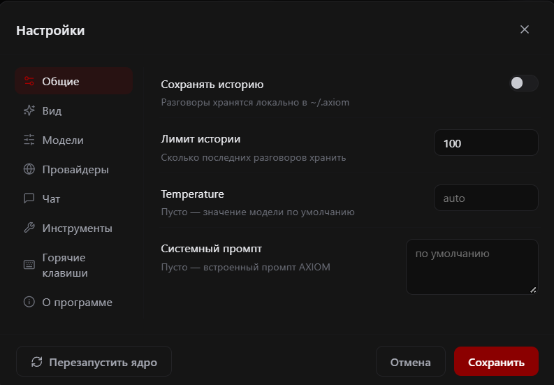

# Конфигурация

## Расположение

| Файл/папка | Назначение |
|---|---|
| `~/.axiom/config.json` | конфигурация |
| `~/.axiom/history/*.json` | сохранённые разговоры (по файлу на разговор) |

Переменная окружения `AXIOM_HOME` переопределяет корневую папку:

```powershell
$env:AXIOM_HOME = "D:\axiom-data"
```

Первый запуск работает без ручной настройки: `config.json` создаётся
автоматически, модель выбирается из обнаруженных.

## Настройки в Desktop GUI

В desktop-приложении настройки открываются через `Ctrl + ,`, кнопку **Настройки**
или команду `/settings`. Это не один общий экран: слева доступны отдельные
разделы **Общие**, **Вид**, **Модели**, **Провайдеры**, **Чат**, **Инструменты**,
**Горячие клавиши** и **О программе**.

### Раздел «Общие»

На изображении ниже открыт именно раздел **«Общие»**. Он меняет базовые
параметры приложения:

| Настройка GUI | Поле конфигурации | Назначение |
|---|---|---|
| Сохранять историю | `save_history` | сохранять разговоры локально в `~/.axiom/history` |
| Лимит истории | `history_limit` | сколько последних разговоров хранить |
| Temperature | `temperature` | значение `auto`/`null` передаёт выбор модели; число задаёт sampling temperature |
| Системный промпт | `system_prompt` | переопределить встроенный системный промпт AXIOM; пустое значение использует встроенный |

Кнопка **Сохранить** применяет изменения, **Отмена** закрывает окно без
сохранения, а **Перезапустить ядро** перезапускает runtime AXIOM. Изменения
общих настроек сохраняются в `config.json` и применяются к следующим запускам
генерации.

Скриншот показывает только содержимое вкладки **«Общие»**. Он не является
изображением всех доступных GUI-настроек: модели, providers, permissions,
workspace и tools находятся в соседних разделах.



### Остальные разделы GUI

- **Вид** — тема, анимации, размер и плотность интерфейса, markdown и автопрокрутка;
- **Модели** — локальные Ollama-модели, внешние модели, `num_ctx`, `num_predict`,
  warm-up и параметры reasoning;
- **Провайдеры** — статус провайдеров, endpoint, скрытый API-ключ, `Test`,
  `Discover models` и выбор модели;
- **Чат** — reasoning, контекст, web search и параметры отображения чата;
- **Инструменты** — режимы разрешений, workspace, terminal и доступность tools;
- **Горячие клавиши** — список сочетаний клавиш desktop GUI;
- **О программе** — версия и сведения о приложении.

Команды `/permissions`, `/profiles`, `/trajectory`, `/providers` и `/agents`
открывают соответствующие runtime-панели. Они не являются отдельными полями
`config.json`, а используют текущую сессию и локальные хранилища.


## Поля config.json

| Поле | Тип | По умолчанию | Описание |
|---|---|---|---|
| `ollama_url` | str | `http://127.0.0.1:11434` | адрес Ollama API |
| `model` | str \| null | `null` | выбранная модель; `null` → авто-выбор первой доступной |
| `think` | bool \| null | `null` | `null` — следовать capability модели; `true/false` — явный запрос reasoning |
| `web_search_enabled` | bool | `true` | разрешить агенту web search |
| `search_max_sources` | int 1–10 | `5` | сколько источников удерживать |
| `search_read_sources` | int 0–10 | `3` | сколько страниц реально читать |
| `show_reasoning` | bool | `true` | показывать reasoning в UI |
| `reasoning_expanded` | bool | `false` | блок reasoning раскрыт сразу |
| `theme` | str | `"obsidian"` | имя темы |
| `animations` | bool | `true` | спиннеры/анимация заставки |
| `save_history` | bool | `true` | сохранять разговоры между запусками |
| `temperature` | float \| null 0–2 | `null` | температура; `null` — параметр не отправляется |
| `system_prompt` | str \| null | `null` | системный промпт; `null` — встроенный |

## Как и когда применяются настройки

* Через панель `/settings` изменения **сохраняются сразу** (каждое
  переключение/Save вызывает `Config.save()` — атомарная запись через
  временный файл).
* `web_search_enabled`, `temperature`, `system_prompt`, `think`,
  `search_read_sources` читаются ядром **при каждой генерации** — применяются
  без перезапуска.
* `reasoning_expanded`, `animations` влияют на **новые** сообщения/запуски.
* Повреждённый `config.json` не приводит к падению: валидные поля
  сохраняются, невалидные отбрасываются (`Config.load`).

## Настройки на один запуск

Все настройки меняются через панель `/settings` в TUI (или Settings в GUI)
и сохраняются в `config.json`. Разовых флагов командной строки больше нет —
`axiom` всегда запускает TUI, `axiom --gui` — десктопный GUI.
